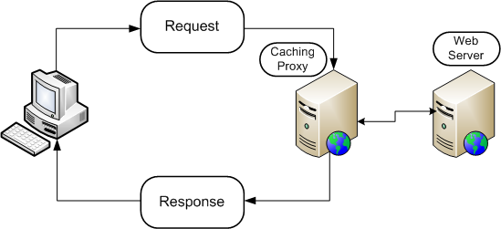
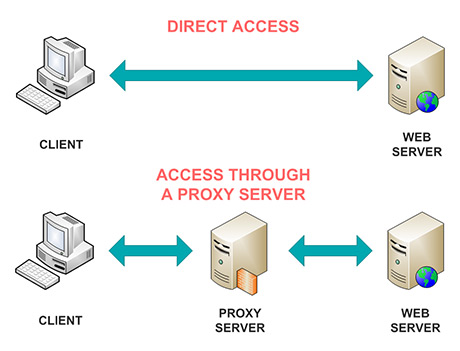
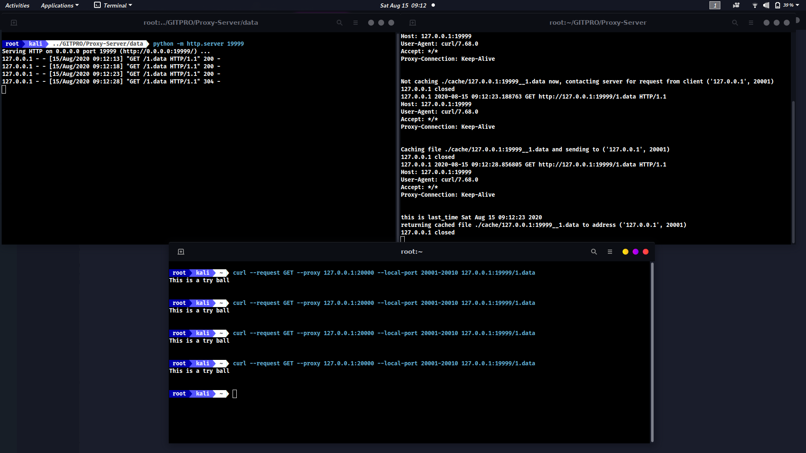

# HTTP-PROXY-AND-CACHING-SERVER

## A PROXY SERVER

***In Computer Networking*** a proxy server is a server application that acts as a intermediary for requests from clients seeking resources from servers that provide those resources.

## A CACHING SERVER

* ***Caching*** is facility that is present inside a proxy server. Web proxy caching stores copies of frequently accessed Web objects (such as documents, images, and articles) close to users and serves this information to them. Internet users get their information faster, and Internet bandwidth is freed for other tasks.
* Internet users direct their requests to Web servers all over the Internet. For a caching server to serve these requests, it must act as a Web proxy server. A Web proxy server receives user requests for Web objects and either serves the requests or forwards them to the origin server (the Web server that contains the original copy of the requested information).

## BENEFITS OF PROXY CACHING

* Users enjoy a faster, more reliable experience by retrieving files that are already cached.
* Enterprises see higher customer satisfaction since proxies allow content to be delivered to customers faster.
* Enterprises also see lower administration costs since infrastructure can be outsourced to third parties such as CDNs.

## ABOUT THE PROJECT

This project deals with setting up a proxy server along with the facility of caching. This project has been done on python and the core of proxy lies in the implementation of python sockets.

## CACHING EXPLAINED

The projects involves certain functions which deals with the caching process.
* ***Cache_Memory():-*** This function acts as a memory for our caching process, it deals with keeping track of all the file resources that has been requested from the client. And for each request made we are saving certain details like the time at which the resource was requested and client address.

* ***Cache_Decision():-*** This function deals with deciding whether to cache current request or not. It checks for the number of times the resource has been requested. If it is more than the threshold then the file resource becomes eligible for second round of screening. In second phase it is tested whether the resource have been requested withing last 10 minutes or not. It it is, caching is done else not.

* ***Get_Current_Cache_Info():-*** This Functions deals with checking whether the resource have been already cached or not. And returns the cache path and the last modification time.

* ***freeup_cache():-*** If cache is full, then his functions deletes the cache record which has been not modified for a while.

* ***if_modified_since_header():-*** This function deals with modifying the request header, by adding an additional header in request named 'if-modified_since'. This header makes the request conditional. The server will send the request with 200 status, only if it has been modified after the given date. If the request has not been modified since, the response will be 304 without any body.

# SCREENSHOT

# REFERENCES
* https://www.geeksforgeeks.org/creating-a-proxy-webserver-in-python-set-1/
* https://alexanderell.is/posts/simple-cache-server-in-python/
* https://github.com/chaitanya100100/Proxy-Server
* https://youtu.be/Lhxwh30kqQ0

